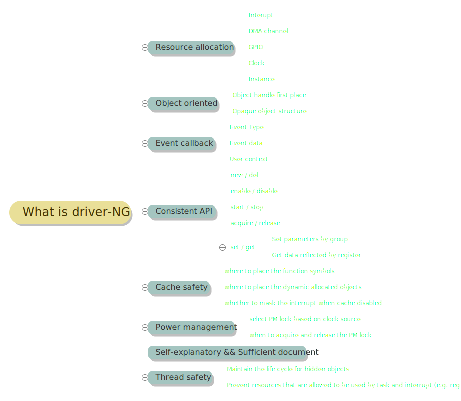

<!-- _footer: "**💕 𝙸𝙳𝙵 Driver Team 💕**" -->


# <!--fit--> OOP in C & Driver-NG

## <!--fit--> How to Write Object Oriented Code in C

---
<!-- _class: invert -->


# **Overview** 📖

* OOP Primitives in C
* Design Pattern - Iterator
* Think in Driver-NG

---
<!-- _backgroundImage: "linear-gradient(to bottom, #8e0038, #fd558f)" -->
<!-- _color: white -->
# <!--fit--> OOP Primitives in C 🧱

---
<!-- paginate: true -->
<!-- _header: "**Encapsulation1 🎁**" -->
<!-- _backgroundImage: url('./assets/hero-background.jpg') -->
<style scoped>code { font-size: 90%; }</style>
<style scoped>li { font-size: 90%; }</style>


- "interface/public_base.h"
  ```c
  typedef struct public_base_t public_base_t;
  struct public_base_t {
  // public members
  int member_id;
  // public methods
  err_t (*func)(public_base_t* obj, void* param);
  // always have this dtor
  err_t (*del)(public_base_t* obj);
  };
  ```
- `obj` <=> `self`(Python), `this`(Java)
- Where should **private** members / methods go?

---
<!-- paginate: true -->
<!-- _header: "**Encapsulation2 🎁**" -->
<!-- _backgroundImage: url('./assets/hero-background.jpg') -->
<style scoped>code { font-size: 80%; }</style>
<style scoped>li { font-size: 80%; }</style>


- "public_api.h"
  ```c
  // declare opaque pointer for object handle
  typedef struct public_base_t* public_base_handle_t;
  // wrapper of public methods declared in `public_base_t`
  err_t public_base_func(public_base_handle_t obj, void* param);
  // destructor function of public base object
  err_t del_public_base(public_base_handle_t obj);
  ```
- "public_api.c"
  ```c
  #include "interface/public_base.h"
  #include "public_api.h"
  err_t public_base_func(public_base_handle_t obj, void* param)
  {
    return obj->func(obj, param);
  }
  ```
- How to create the `public_base_handle_t` object?

---
<!-- _header: "**Inheritance1 🔏**" -->
<!-- _backgroundImage: url('./assets/hero-background.jpg') -->
<style scoped>code { font-size: 90%; }</style>
<style scoped>li { font-size: 80%; }</style>


- "my_private_obj.c"
  ```c
  #include "interface/public_base.h"
  typedef struct my_type_t my_type_t;
  struct my_type_t {
    // Inherit one base type
    public_base_t base1;
    // Inherit another base type
    another_public_base_t base2;
    // private members
    char name[MAX_NAME_LEN];
    // private methods
    int (*my_func)(my_type_t* obj, void* param);
  };
  ```
- There's `my_type2_t` that also inherits the `public_base_t`
- Thus have separate constructors for these private types is a good practice

---
<!-- _header: "**Inheritance2 🔏**" -->
<!-- _backgroundImage: url('./assets/hero-background.jpg') -->
<style scoped>code { font-size: 90%; }</style>
<style scoped>li { font-size: 90%; }</style>


- Create `public_base_handle_t` object of type `my_type_t`

---
<!-- _header: "**Polymorphism 👨‍👩‍👧‍👦**" -->
<!-- _backgroundImage: url('./assets/hero-background.jpg') -->


---
<!-- _paginate: false -->
<!-- _backgroundImage: "linear-gradient(to bottom, #0d47a1, #42a5f5)" -->
<!-- _color: white -->
# <!--fit--> Design Pattern - Iterator 🎨

---
<!-- _paginate: false -->
<!-- _backgroundImage: "linear-gradient(to bottom, #FF6D00, #FFAB40)" -->
<!-- _color: white -->

# <!--fit--> Think in Driver-NG 🧌

---
<!-- _header: "**What prevents a driver from growing further 🧐**" -->
<!-- _backgroundImage: url('./assets/hero-background.jpg') -->


- Functional shrinking 🤏
- Poor scalability 👴
- No FSM, No lifecycle 😵
- No modeling, No design 🈚
- Uncertain workaround ➰
- Lack of scenario 🥅
- *Bad taste* in code 🪰
- Uncertainty of Cache safety 🤔

---
<!-- _header: "**What is driver-ng ❓️**" -->
<!-- _backgroundImage: url('./assets/hero-background.jpg') -->
<style scoped>li { font-size: 80%; }</style>


- `driver/xxx.h` for *public* API
- `esp_private/xxx.h` for *private* API

---
<!-- _header: "**API naming conventions 1 ☯**" -->
<!-- _backgroundImage: url('./assets/hero-background.jpg') -->
<style scoped>code { font-size: 90%; }</style>
<style scoped>li { font-size: 85%; }</style>
- Resource allocation
  ```c
  esp_err_t <periph>_new_<obj>(const <periph>_<obj>_config_t *config,
                     <periph>_<obj>_handle_t *ret_handle);
  esp_err_t <periph>_del_<obj>(<periph>_<obj>_handle_t handle);
  ```
  - If the resource is lazy allocated, driver should take of any potential concurrency issue
- IO Controls
  ```c
  esp_err_t <periph>_<obj>_<verb>(<periph>_<obj>_handle_t handle,
                                  optional_configurations);
  ```
- ISR callbacks
  ```c
  typedef bool (*<periph>_<event>_cb_t) (<periph>_<obj>_handle_t handle,
                <periph>_<event>_data_t *edata,
                void *user_ctx);
  ```

---
<!-- _header: "**API naming conventions 2 ☯**" -->
<!-- _backgroundImage: url('./assets/hero-background.jpg') -->
<style scoped>code { font-size: 90%; }</style>
<style scoped>li { font-size: 85%; }</style>
- Register ISR callbacks
  ```c
  esp_err_t gptimer_register_event_callbacks(<periph>_<obj>_handle_t handle,
                                            <periph>_event_callbacks_t *cbs,
                                            void *user_data);
  ```

---
<!-- _header: "**Necessary test**" -->
<!-- _backgroundImage: url('./assets/hero-background.jpg') -->
<style scoped>code { font-size: 90%; }</style>
<style scoped>li { font-size: 85%; }</style>

- Cross section reference check
- PM enable
- Release mode

---
<!-- _header: "**Minimize breaking change 🦹**" -->
<!-- _backgroundImage: url('./assets/hero-background.jpg') -->


- Any breaking change should have a **transition** phase
- **Reserve** the legacy driver API
- Adding both compile time and runtime **deprecating** warnings
- **Prevent coexist** of the legacy driver and new driver, with the help from linker

---
<!-- _header: "**Asking yourself 🙋**" -->
<!-- _backgroundImage: url('./assets/hero-background.jpg') -->
<style scoped>li { font-size: 80%; }</style>

- What if this API is invoked in different threads (or ISR handler)? Have you protected all shared resources (including the register fields)?
- Which kind of lock is the best for this scenario?
- Can this API be invoked in ISR handler?
- Is the memory resource allocated from SRAM or PSRAM? Should it be DMA capable?
- During driver initialization, are these configurations necessary?
- What if the peripheral supports more interrupt and DMA features?
- Have you hide all details/concepts that the users don't have to know?
- Should the ISR handler work wen cache disabled?
